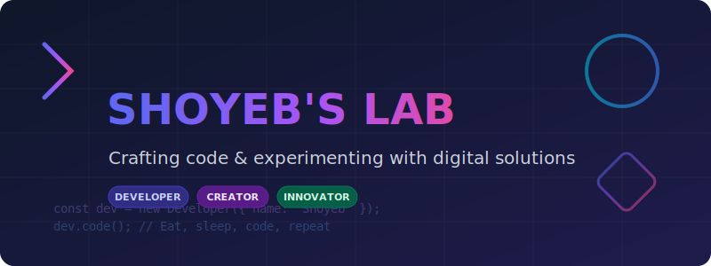

  

  

---

### 💫 About Me

Hello! I'm **Shoyeb**, a passionate software developer dedicated to crafting clean code, designing intuitive user interfaces, and solving complex problems. I love experimenting with new technologies in my "lab" (hence *Shoyeb's Lab*) and turning creative ideas into functional digital products.

- 🔭 **Current Focus:** Developing full-stack web applications with modern architectures.
- 🌱 **Learning:** Delving deeper into AI integrations, Cloud Native systems, and advanced System Design.
- 🤝 **Collaboration:** Open to collaborating on open-source projects, SaaS products, and innovative startups.
- ⚡ **Fun Fact:** I believe that writing code is a form of digital craftsmanship—every line should have a purpose.

---

### 🛠️ Tech Stack & Toolbox

<b>Frontend Development</b>

 

  
  
  
  
  
  
  

<b>Backend & Databases</b>

 

  
  
  
  
  
  
  

<b>DevOps & Tools</b>

 

  
  
  
  
  
  

---

### 📊 GitHub Stats

<table width="100%">
  <tr>
    <td width="50%" align="center">
      
    </td>
    <td width="50%" align="center">
      
    </td>
  </tr>
</table>

  

---

### 📬 Let's Connect!

I'm always excited to discuss new tech, bounce ideas around, or collaborate on cool projects. Get in touch with me:

  
  
  
  

